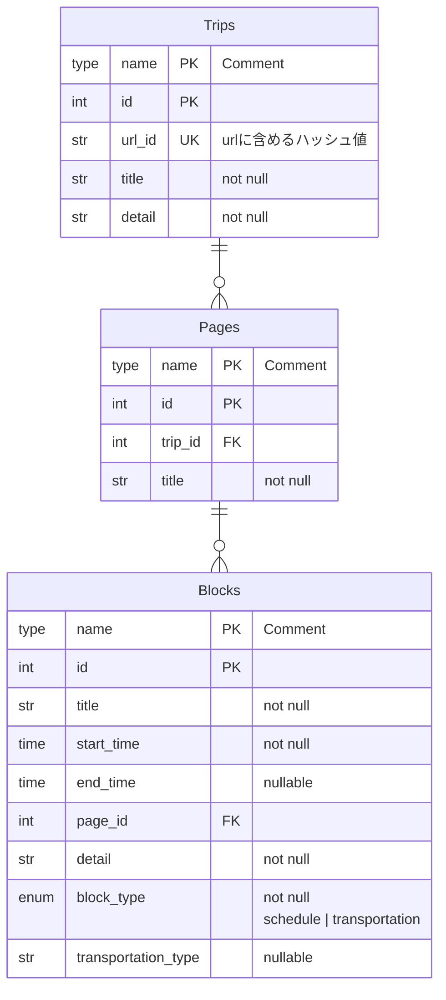

# DBの論理設計図

```mermaid
erDiagram
  Pages {
    type name PK "Comment"
    int id PK
    int trip_id FK
    str title "not null"
  }
  Trips {
    type name PK "Comment"
    int id PK
    str url_id UK "urlに含めるハッシュ値"
    str title "not null"
    str detail "not null"
  }
  Blocks {
    type name PK "Comment"
    int id PK
    str title  "not null"
    time start_time  "not null"
    time end_time "nullable"
    int page_id FK
    str detail "not null"
    enum block_type      "not null <br>schedule | transportation"
    str transportation_type  "nullable"
  }
  Trips ||--o{ Pages :""
  Pages ||--o{ Blocks : ""
```
