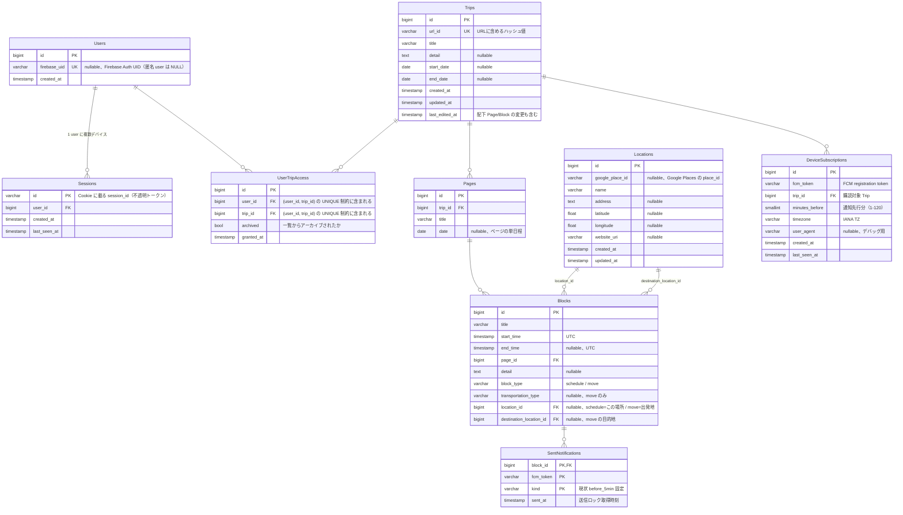

# DBの論理設計図

## 認可モデルの補足

- 認可判定は常に `UserTripAccess` を参照する（認証・未認証で分岐しない）
- Cookie 発行時に匿名 `User` レコード (`firebase_uid IS NULL`) を自動作成
- Firebase Auth 認証時、匿名 user の `firebase_uid` を埋めて昇格、または既存 user へマージ
- `UserTripAccess.(user_id, trip_id)` の UNIQUE 制約と `INSERT ... ON CONFLICT DO NOTHING` により、並列付与の race を idempotent 化
