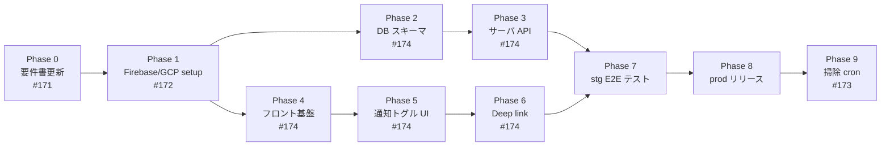

# 通知機能 実装ロードマップ

> **注意**: 本ドキュメントは Issue #148 の通知機能実装のフェーズ計画メモです。実装の一次情報ではないため、実装時は必ずソースコードと Issue の実状を正としてください。

関連: [notification_design.md](./notification_design.md), [firebase_setup.md](./firebase_setup.md)
関連 Issue: #148 (親), #171, #172, #173, #174

## 全体像

**Phase 2 と Phase 4 は並行実行可能** (バックエンド/フロント担当が分かれる場合)。

---

## Phase 0: 前提整備

**目的**: 実装前の情報整理

- [ ] #171 `docs/requirements.md` の技術スタック記述を最新実装状況に合わせて更新
  - Firebase Auth 未実装 → 「計画中」明記
  - MySQL → PostgreSQL
  - Railway → GCP Cloud Run

**依存**: なし
**成果物**: 更新済み requirements.md
**目安工数**: 半日

---

## Phase 1: Firebase / GCP セットアップ (ADC 方式)

**目的**: FCM 送信基盤と cron トリガーを用意する (Issue #172)

- [x] Firebase コンソールで Cloud Messaging 有効化
- [x] VAPID 鍵ペア生成 → `.env` に `VITE_FIREBASE_VAPID_KEY` を設定
- [x] Firebase Web SDK 設定値取得 → `.env` に反映 (7 変数 × 3 環境)
- [x] **`tabi-share-api-runtime` SA に `roles/firebasecloudmessaging.admin` を IAM 付与** (SA JSON 発行なし)
- [x] **Cloud Scheduler 用 SA (`tabi-share-notify-scheduler`) を新規作成**
- [ ] Cloud Scheduler ジョブ作成 (stg / prod 分けて) — **Phase 3 の tick エンドポイント実装 & デプロイ後に実施**
- [ ] stg 環境で **手動疎通確認** (Cloud Scheduler → Cloud Run → 200 応答)

**依存**: Phase 0
**成果物**: FCM 送信可能状態 (ADC 認証)、`/internal/notify/tick` に定期 HTTP が届く状態
**目安工数**: 1〜2 日 (GCP コンソール作業に慣れているか次第)

**方針変更メモ**: 当初は SA JSON を発行して Secret Manager 経由で Cloud Run に注入する予定だったが、既存の `tabi-share-api-runtime` SA に IAM 権限を直接付与する ADC 方式に変更。SA JSON がファイルとして存在しないため漏洩リスク・ローテーション不要でよりセキュア。詳細は [firebase_setup.md](./firebase_setup.md) セクション 4 参照。

---

## Phase 2: DB スキーマ

**目的**: 通知データを保存するテーブルを作る

- [ ] Alembic マイグレーション作成:
  - `device_subscriptions` テーブル追加
  - `sent_notifications` テーブル追加
  - `blocks.start_time` に INDEX 追加
- [ ] SQLAlchemy モデル追加 (`server/app/models.py`)
- [ ] Pydantic スキーマ追加 (`server/app/schemas/`)
- [ ] stg 環境でマイグレーション適用確認

**依存**: Phase 1 (完全依存ではない、並行可能)
**成果物**: DB スキーマ完成
**目安工数**: 半日

---

## Phase 3: サーバ API 実装

**目的**: 購読管理と定期通知送信のバックエンドを実装

- [ ] `firebase-admin` (Python) を pyproject.toml に追加
- [ ] Firebase Admin SDK 初期化ロジック (`server/app/main.py` or 起動時 hook)
- [ ] CRUD 実装 (`server/app/cruds/notification.py`):
  - subscribe / unsubscribe / get_subscription
  - insert_sent_notification (ON CONFLICT DO NOTHING)
  - delete_by_fcm_token (失効時)
- [ ] ルーター実装 (`server/app/routers/notification.py`):
  - `POST /api/v1/trips/{trip_id}/subscription`
  - `DELETE /api/v1/trips/{trip_id}/subscription`
  - `GET /api/v1/trips/{trip_id}/subscription?fcm_token=...`
  - `POST /api/v1/trips/{trip_id}/subscription/test` (テスト送信、rate limit 付き)
- [ ] tick エンドポイント (`server/app/routers/notification_internal.py`):
  - `POST /internal/notify/tick`
  - Cloud Scheduler OIDC トークン検証
  - スキャンクエリ (Trip.start_date IS NOT NULL、未送信 & 未来 & minutes_before 以内)
  - INSERT-first (`ON CONFLICT DO NOTHING`)
  - FCM `send_each` バッチ送信 (TTL=300, Urgency=high, 最大 500 件/回)
  - 失効エラー時に device_subscriptions から token 削除
- [ ] ユニットテスト
  - 重複阻止 (同一 block × token × kind で 2 回 INSERT → 1 件のみ成功)
  - Trip.start_date IS NULL の除外
  - タイムゾーン整形 (device_subscriptions.timezone を反映)

**依存**: Phase 1 + Phase 2
**成果物**: サーバ側実装完了
**目安工数**: 2 日

---

## Phase 4: フロント基盤

**目的**: Firebase SDK / SW / 認可済み hook の下地

- [ ] `firebase` を `frontend/package.json` に追加
- [ ] Firebase 初期化 (`frontend/src/lib/firebase.ts`)
- [ ] `frontend/public/firebase-messaging-sw.js` を配置 (VitePWA SW と併存)
- [ ] Firebase Messaging 初期化 & `getToken` ユーティリティ (`frontend/src/lib/messaging.ts`)
- [ ] `useTripSubscription(tripId)` SWR フック追加
- [ ] iOS / PWA install 判定ユーティリティ (`frontend/src/lib/platform.ts`)

**依存**: Phase 1 (VAPID鍵 & Web SDK 設定値が必要)
**成果物**: SW 登録され、`getToken()` が呼べる状態
**目安工数**: 半日

---

## Phase 5: 通知トグル UI + iOS install 誘導

**目的**: ユーザが通知を ON/OFF できる UI

- [ ] Trip 閲覧ページヘッダーにベルアイコン配置 (`Bell` / `BellOff`)
- [ ] トグル ON フロー:
  - iOS 未 install 検知 → 「アプリとしてインストールする必要があります」アラート
  - install 手順モーダル (Safari 共有 > ホーム画面に追加)
  - `requestPermission()` → `getToken()` → 購読 API
- [ ] トグル OFF フロー: 購読 API DELETE
- [ ] 成功/エラートースト (`Sonner` / `toast`)
- [ ] 権限 denied 時ヘルプ (OS 設定へのリンク)
- [ ] Trip.start_date が null 時に ON にした場合のアラート
- [ ] Page.date null 時の黄色アテンション (通知 ON 状態でページ追加/編集時)
- [ ] **テスト送信ボタン** (ON 時のみ表示、5 秒 rate limit)

**依存**: Phase 4
**成果物**: トグル操作でユーザに通知が届く (テスト送信で疎通確認可)
**目安工数**: 1 日

---

## Phase 6: Deep link 連携

**目的**: 通知タップで該当ブロックへスクロール

- [ ] `firebase-messaging-sw.js` の `notificationclick` ハンドラ実装
  - `clients.matchAll` で既存タブ検索
  - 該当 trip タブあれば `focus` + `postMessage({ type: 'FOCUS_BLOCK', blockId })`
  - なければ `openWindow(?focusBlock={id})`
- [ ] TripPage 側で `?focusBlock` URL param 検知
- [ ] `useFocusBlock` フック (scrollIntoView + ハイライト、`useCurrentTime` の近くに実装)
- [ ] postMessage 経由の scroll も同じフックで対応
- [ ] フォアグラウンド `onMessage` トースト (`MoveRight` アイコン付きボタン)

**依存**: Phase 4 + Phase 5
**成果物**: 通知タップで該当ブロックへ smooth scroll
**目安工数**: 半日

---

## Phase 7: stg 環境 E2E テスト

**目的**: 実機で通知が「届く / タップで正しく飛ぶ」ことを確認

- [ ] iOS Safari (16.4+) 実機:
  - PWA install → permission → 購読 → テスト送信で届くこと
  - 実 block を 5 分後の時刻で作成 → 5 分前に通知が来ること
  - タップで該当ブロックへスクロールすること
- [ ] Android Chrome 実機:
  - 通常タブから購読 → テスト送信で届くこと
  - 5 分前通知の到達確認
- [ ] Desktop Chrome / Edge:
  - 同上
- [ ] 失敗ケース確認:
  - permission denied 時のヘルプ表示
  - 通知 ON 中に Trip 削除 → device_subscriptions が消えること
- [ ] Android 用モノクロ Badge PNG 作成 & 配置

**依存**: Phase 3 + Phase 6
**成果物**: stg で全プラットフォーム動作確認
**目安工数**: 1 日 (実機用意含む)

---

## Phase 8: prod リリース

**目的**: 本番環境へロールアウト

- [ ] prod 環境変数設定 (VAPID鍵、Firebase Admin credentials)
- [ ] prod 用 Cloud Scheduler ジョブ作成
- [ ] frontend/backend を prod にデプロイ
- [ ] リリース後の動作確認 (テスト送信)
- [ ] ログ監視 (`log.info` の送信/失敗ログ、失効 token 削除ログ)

**依存**: Phase 7
**成果物**: 本番運用開始
**目安工数**: 半日

---

## Phase 9: 後追い (Phase 2 相当)

**目的**: MVP 後の改善

- [ ] #173 `sent_notifications` 掃除 cron 実装
- [ ] Cloud Monitoring カスタムメトリクス (送信数 / 失敗率 / 失効 token 数)
- [ ] 送信失敗リトライ機構 (`sent_notifications.status` 列追加)
- [ ] 通知集約 (連続開始ブロックの疲労対策)
- [ ] ブロック単位の通知 ON/OFF
- [ ] `minutes_before` UI 設定 (5/10/30 分プリセット)
- [ ] 通知内容のぼかしオプション (プライバシー)

**依存**: Phase 8 (稼働実績に応じて優先度判断)
**目安工数**: 都度

---

## 合計目安工数

**MVP (Phase 0〜8)**: 約 **6〜8 日** (個人開発の実働時間として)

**並行実行時の短縮**: Phase 2〜3 (バックエンド) と Phase 4〜6 (フロント) を並行できると **4〜5 日** に短縮可能。

---

## クリティカルパス

Phase 1 (Firebase/GCP セットアップ) が全ての起点。ここが遅れると全体が遅れる。**Phase 1 を最優先で片付ける**のが推奨。

---

## PR 分割戦略

grill セッションで確定した「動作確認できる単位」で PR を分割:

| PR | 内容 | Verify Point | 担当 worktree |
|---|---|---|---|
| **PR α (schema)** | Phase 2: DB スキーマ (device_subscriptions / sent_notifications / blocks.start_time index) | `alembic upgrade` が通る | `issue148-db-schema` (base: origin/develop) |
| **PR β+γ (verify unit)** | docs + Phase 3〜7: Backend 購読 API + tick + Frontend トグル UI + テスト送信 + Cloud Scheduler | **実機で「トグル ON → テスト送信 → 通知届く」+「5 分前自動通知届く」** | 現ブランチ `feature/issue148_notification` (base: origin/develop、α マージ後にリベース) |
| **PR δ** | Phase 6 の Deep link 部分 (通知タップで該当ブロックへ移動) | 通知タップで smooth scroll & ハイライト | 別 PR で切り出す想定 (β+γ 完了後) |

**依存関係**:
- α → β+γ (schema がないと API が動かない)
- β+γ → δ (基本フロー動いた後で deep link を追加)
- α と β+γ は並列作業可能 (β+γ の SDK 導入や基盤コードは α マージ前でも書ける)

**Cloud Scheduler ジョブ作成タイミング**:
- Phase 1 チェックリストからは外し、β+γ の中で tick エンドポイントを stg デプロイした直後に作成
- stg → prod 順に作る
