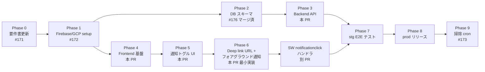

# 通知機能 実装ロードマップ

> **注意**: 本ドキュメントは Issue #148 の**フェーズ計画と設計変遷の記録**です。
> 実装仕様は [docs/notifications.md](../notifications.md) を参照してください。

関連 Issue: #148 (親), #171, #172, #173, #174

## Phase 概観

## 完了状態

### Phase 1: Firebase / GCP セットアップ

- [x] Firebase Cloud Messaging 有効化
- [x] VAPID 鍵ペア生成 → `.env` に `VITE_FIREBASE_VAPID_KEY`
- [x] Firebase Web SDK 設定値取得 → `.env` に反映 (7 変数 × 3 環境)
- [x] `tabi-share-api-runtime` SA に `roles/firebasecloudmessaging.admin` を IAM 付与
- [x] Cloud Scheduler 用 SA (`tabi-share-notify-scheduler`) を新規作成
- [ ] Cloud Scheduler ジョブ作成 (stg / prod) — **本 PR デプロイ後に実施**
- [ ] stg 環境で手動疎通確認

### Phase 2: DB スキーマ (PR #176)

- [x] Alembic マイグレーション、SQLAlchemy モデル、Pydantic スキーマ、smoke test
- [x] develop にマージ済み

### Phase 3-6: Backend API + Frontend UI + 最小 Deep link (本 PR)

- [x] 購読 CRUD + 送信ロック (INSERT-first)
- [x] 購読 API (POST/DELETE/GET/test)
- [x] tick エンドポイント (OIDC 検証込み)
- [x] Firebase Admin SDK 初期化 (ADC)
- [x] Firebase Messaging Web SDK + SW
- [x] 通知トグル UI + iOS install 誘導
- [x] `useTripSubscription` フック (SWR)
- [x] `useConfirm` hook (削除確認等の統一パターン)
- [x] Story (View 系) + Vitest テスト (フロー分岐)
- [x] Deep link URL 埋め込み (`?focusBlock={block_id}` を FCM `data.link` に付与)
- [x] フォアグラウンド OS 通知 (`useForegroundNotificationToast` → `registration.showNotification`)

### Phase 6b-9

- [x] SW `notificationclick` ハンドラ (#207): tap で既存 client に postMessage → SPA navigate、無ければ openWindow。client 側は `useFocusBlockOnMount` で block まで scroll
- [ ] Phase 7: stg 環境 E2E テスト (iOS/Android/Desktop 実機)
- [ ] Phase 8: prod リリース + Cloud Scheduler ジョブ作成
- [ ] Phase 9 (#173): `sent_notifications` 掃除 cron

## 設計変遷 (方針変更の記録)

### ADC 方式への変更 (Phase 1c)

**当初**: Service Account JSON を Firebase コンソールから発行 → Secret Manager 経由で Cloud Run に注入。

**変更後**: 既存 `tabi-share-api-runtime` SA に `roles/firebasecloudmessaging.admin` を IAM で直接付与し、
Firebase Admin SDK を `initialize_app()` (引数なし) で ADC 経由に。

**理由**:
- SA JSON がファイルとして存在しない (漏洩リスク・ローテーション不要)
- Secret Manager 経由の JSON 保管も不要
- IAM 一元管理でシンプル

### PR 分割戦略の再編

**当初**: PR α (schema) → PR β+γ (verify unit) → PR δ (deep link)

**変更後 (本 PR = β+γ)**:
- α (#176) は develop マージ済み → 現 PR は develop 直接派生
- β+γ の verify point は「実機で 5 分前通知が届く」
- δ は本 PR で最小実装 (deep link URL のみ)、SW `notificationclick` の高度なハンドリングは別 PR

### tick 過負荷対策の Phase 2 送り

grill セッションで検討した Advisory Lock / Cloud Run request timeout / バッチ LIMIT 等は、
現状の subscription 規模では過剰と判断し **MVP は `sent_notifications` PK + elapsed_ms ログ**のみ実装。
subscription 数増加や tick 遅延が観測されたら Phase 2 で対応。

### 通知内容ぼかしオプションの見送り

ロック画面プライバシーの観点で「内容をぼかす」オプションを検討したが、
「ユーザが自分で通知 ON にする以上受容可」と判断し MVP 見送り。Phase 2 候補として保留。

## クリティカルパス

Phase 1 (Firebase/GCP セットアップ) が全ての起点だった。α (DB スキーマ) も並列で進んだが、
β+γ (本 PR) は α マージ後にリベースして実 API 結合を完成させた。

次のクリティカルパスは **stg 環境の Cloud Scheduler ジョブ作成 + iOS 実機 verify**。
